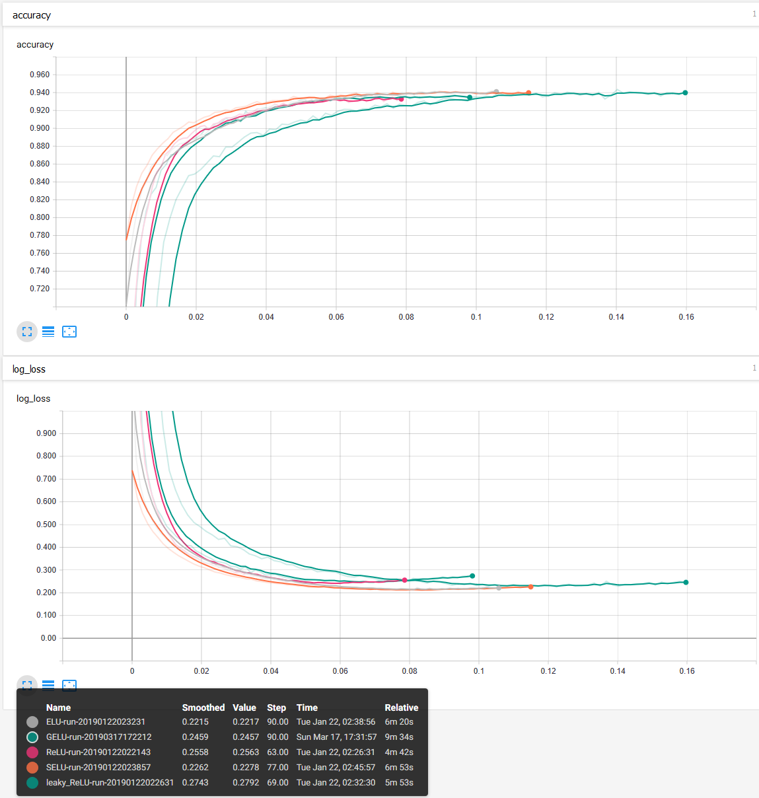

# Training Deep Neural Networks

## Introduction

In this repository, the performance of various techniques for training deep neural networks (DNNs) is evaluated. This is achieved using a simple feed forward neural network architecture, trained on the Kuzushiji-MNIST (KMNIST) dataset1 of Japanese Hiragana characters.

The model code and techniques explored takes inspiration from the book Hands-on Machine Learning with Scikit-Learn and TensorFlow.2 By default, a simple neural network architecture comprising five hidden layers of 100 neurons is employed. Training is run until no improvement is seen for validation log loss over 20 epochs. Full details of model training can be viewed in the [models.ipynb](models.ipynb) notebook.

## Training Techniques

### DNN Architectures

All permutations of neural network architecture between 3-6 layers and 50/100/200 neurons per layer were evaluated. Figure 1 shows faster convergence and overfitting for three layers versus deeper architectures. The training time per step is higher for the deeper networks.

***Figure 1:*** *Altering the number of layers in the DNN.*

Increasing the number of neurons per layer (Figure 2) resulted in higher accuracies and longer train times.

***Figure 2:*** *Changing the number of neurons per layer in the DNN.*

 

### Training Optimisers

The popular Adam optimiser generally used by default for modern deep learning training tasks performed best (Figure 3). Momentum and Nesterov optimisation methods also showed superior performance to simple gradient descent, however Adagrad performed poorly for this task with these hyperparameters.

***Figure 3:*** *Accuracy and log loss curves for different optmisers.*

 

### Activation Functions

Although SELU and ELU initially showed fastest convergence, ReLU and leaky-ReLU ultimately converged in fewer steps and shorter wall time. However, ELU and SELU both achieved better final accuracy (Figure 4).

***Figure 4:*** *Accuracy and log loss curves for different activation functions.*

 

### Learning Rates

Unsurprisingly, higher learning rates resulted in faster training times in fewer steps (Figure 5). Learning rates higher than 0.1 crashed the model.

***Figure 5:*** *Accuracy and log loss curves for different learning rates.*

 

### Batch Normalised Momentums

Implementing batch normalised momentum slowed training dramatically (~4x) but resulted in superior final model performance. Higher momentum values gave better final log loss (Figure 6).

***Figure 6:*** *Accuracy and log loss curves for different batch normalised momentums.*

 

### Dropout

Dropout dramatically increased train time (~6-12x) although achieved better final model log loss in the case of 10% and 30% dropout (Figure 7). The model with 50% dropout ended after 616 steps with notably worse performance than the other models, presumably having failed to truly converge but hitting the 20-epoch limit without making progress. Clearly, implementing significant dropout is overkill for this simple task using a shallow DNN.

***Figure 7:*** *Accuracy and log loss curves when using dropout.*

 

---
#### References: 
1: [Forecasting: Principles and Practice](https://otexts.org/fpp2/simple-methods.html) 
2: [Hands-on Machine Learning with Scikit-Learn and TensorFlow](https://github.com/ageron/handson-ml)
